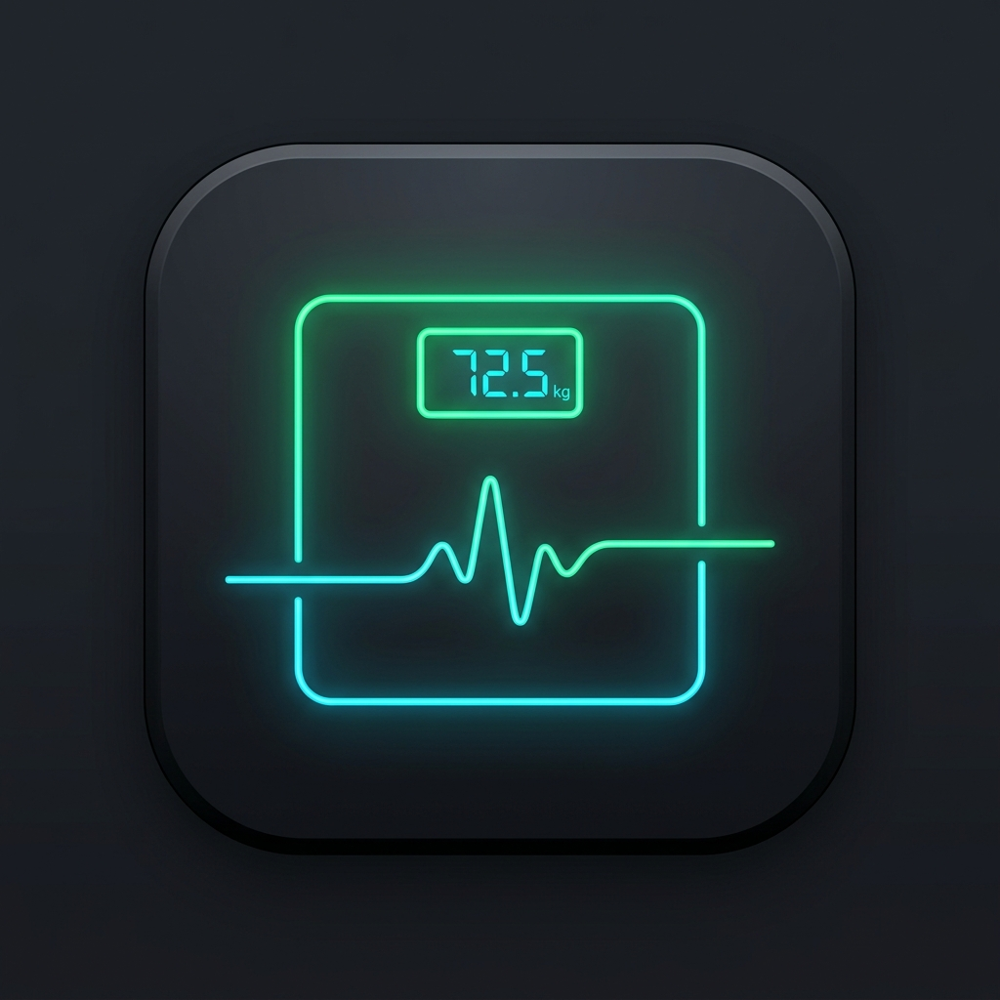

# ⚖️ FitTrack Pro - 스마트 체중 일기 & 심층 분석

> 매일 간편하게 몸무게를 기록하고, 7일 이동평균선(체지방 감량 추세)과 감량 속도 기반 목표 도달일을 스마트하게 예측하는 프리미엄 웹 대시보드입니다.

## ✨ 주요 기능
- **간편한 일일 기록**: 0.1kg 미세 스텝 조절, 공복/저녁 구분, 체지방률 & 골격근량, 컨디션 태그 및 메모.
- **심층 통계 & 이동평균선**: 일일 수분 변동(부종) 노이즈를 제거한 **7일 이동평균선(SMA)** 및 주간 순증감량 차트.
- **스마트 목표 예측**: 최근 2주간 감량 속도를 바탕으로 목표 체중에 도달할 정확한 날짜 자동 시뮬레이션.
- **외부 스마트폰 접속 (PWA)**: 아이폰 사파리 '홈 화면에 추가' 시 네이티브 앱처럼 동작.
- **구글 시트(Google Sheets) 클라우드 연동**: 내 구글 시트를 무료 클라우드 DB로 영구 활용.

## 🚀 빠른 시작
1. 맥북에서 `start.command` 파일을 더블 클릭하여 실행합니다.
2. 브라우저가 열리면 대시보드를 바로 사용하거나 우측 상단 **[📱 외부 연결]**의 QR 코드를 아이폰으로 스캔하세요.
3. 배포 가이드는 [DEPLOY.md](DEPLOY.md)를 참고하세요.
